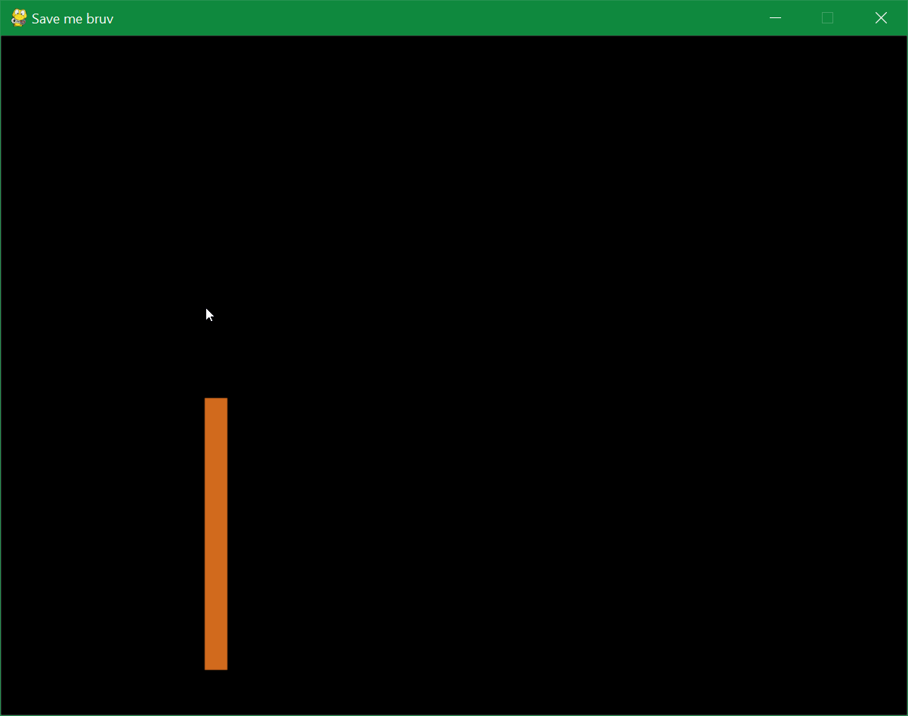

# cellular-automata
sand and water cellular automata with some language that decides to work for me...  
Anyways, cellular automata does involve the use of grid, but I attempted to do just that without a grid.

# Rust Version (main ver)
Implementing this version with `Specs` and `GGEZ`.
Both water and sand are functional

# Python Version
Utilizes `ecs` and `pygame` to provide a simulation of sand and water.

